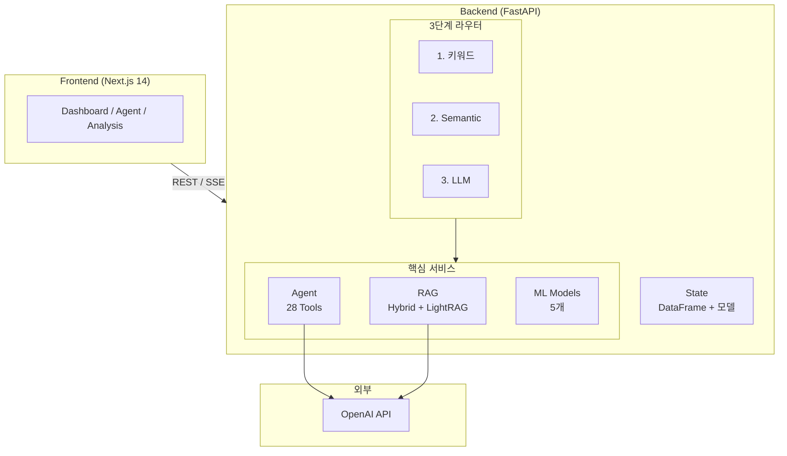
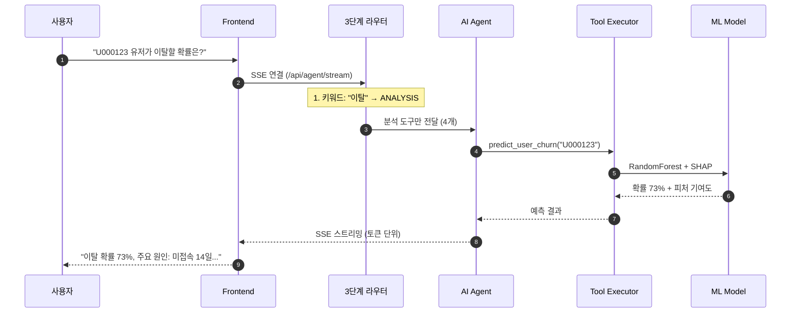
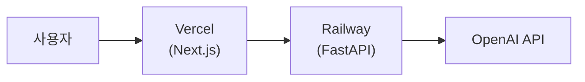

# CookieRun AI Platform

<div align="center">

**데브시스터즈 ML 엔지니어 포트폴리오**

LLM + ML을 활용한 쿠키런 세계관 AI 통합 플랫폼

[](https://python.org)
[](https://fastapi.tiangolo.com)
[](https://nextjs.org)
[](https://openai.com)

~~데모 보기~~ · [API 문서](https://cookierun-api-production-6adb.up.railway.app/docs) · 개발 기간: 2026.01.30 ~ 진행중

</div>

---

## 프로젝트 개요

### 배경 및 목적

**CookieRun AI Platform**은 게임 운영에 필요한 다양한 AI/ML 기능을 하나의 통합 플랫폼으로 제공합니다.

| 문제 | 기존 방식 | AI 플랫폼 솔루션 |
|------|----------|------------------|
| **유저 이탈** | 이탈 후 사후 분석 | 이탈 전 예측 + SHAP 기반 원인 분석 |
| **어뷰징 탐지** | 수동 모니터링, 신고 기반 | Isolation Forest 자동 탐지 |
| **세계관 일관성** | 번역가/작가 개인 지식 의존 | RAG 기반 지식 검색 + 일관성 검증 |
| **번역 품질** | 전수 검수 (비용/시간 문제) | ML 기반 품질 예측 → 우선순위 검수 |
| **데이터 분석** | SQL 작성, 대시보드 개발 필요 | 자연어 질의 → 자동 분석 |

### 기술적 차별점

| 특징 | 설명 |
|------|------|
| **LLM + ML 하이브리드** | GPT-4o-mini + 전통 ML 모델 결합 |
| **3단계 라우터** | 키워드 → Semantic → LLM Router |
| **RAG-Fusion + LightRAG** | 싱글홉/멀티홉 최적화 |
| **SHAP 해석** | 이탈 원인 피처별 기여도 |
| **실시간 스트리밍** | SSE 기반 토큰 스트리밍 |
| **MLflow** | 모델 실험 추적/버전 관리 |

---

## 핵심 기능

| 기능 | 설명 | 기술 |
|------|------|------|
| **AI 에이전트** | 자연어로 데이터 분석 요청 | GPT-4o-mini + 28개 도구 |
| **RAG 검색** | 세계관 지식 기반 답변 | Hybrid Search + LightRAG |
| **K²RAG** | KG + Sub-Q + Hybrid 고정밀 검색 | **개발 중** |
| **이탈 예측** | 유저 이탈 확률 + SHAP 해석 | RandomForest + SHAP |
| **이상 탐지** | 어뷰징/봇 유저 탐지 | Isolation Forest |
| **승률 예측** | 쿠키 PvP 승률 예측 | LightGBM |
| **투자 최적화** | 쿠키 육성 ROI 추천 | P-PSO 알고리즘 |

---

## 시스템 아키텍처



### 요청 처리 흐름



---

## 프로젝트 구조

```
데브시스터즈 프로젝트/
│
├── README.md                           # 프로젝트 개요 (이 파일)
│
├── backend 리팩토링 시작/              # FastAPI 백엔드
│   ├── README.md                       # ★ 백엔드 상세 문서
│   ├── main.py                         # FastAPI 앱
│   ├── state.py                        # 전역 상태
│   ├── api/                            # REST API (90+)
│   ├── agent/                          # AI 에이전트 (28개 도구, 3단계 라우터)
│   ├── rag/                            # RAG 시스템 (Hybrid, LightRAG, K²RAG)
│   ├── ml/                             # ML 모델 (5개)
│   ├── core/                           # 핵심 유틸리티
│   ├── *.csv (17개)                    # 데이터
│   └── *.pkl (15개)                    # 모델
│
└── nextjs/                             # Next.js 프론트엔드
    ├── README.md                       # ★ 프론트엔드 상세 문서
    ├── pages/                          # 페이지 라우팅
    ├── components/panels/              # 기능별 패널 (8개)
    ├── lib/                            # 유틸리티
    └── styles/                         # 스타일
```

> **상세 문서**: [백엔드 README](backend%20리팩토링%20시작/README.md) · [프론트엔드 README](nextjs/README.md)

---

## 빠른 시작

### 요구사항

- Python 3.10+
- Node.js 18+
- OpenAI API Key

### 백엔드 실행

```bash
cd "backend 리팩토링 시작"
python -m venv venv && venv\Scripts\activate  # Windows
pip install -r requirements.txt
set OPENAI_API_KEY=sk-...
python ml/train_models.py  # 최초 1회 (데이터/모델 생성)
uvicorn main:app --reload --port 8001
```

### 프론트엔드 실행

```bash
cd nextjs
npm install
npm run dev
```

### 접속

| 서비스 | URL |
|--------|-----|
| 프론트엔드 | http://localhost:3000 |
| 백엔드 API | http://localhost:8001 |
| Swagger 문서 | http://localhost:8001/docs |

### 테스트 계정

| 계정 | 비밀번호 | 역할 | 접근 패널 |
|------|---------|------|----------|
| `admin` | `admin123` | 관리자 | 전체 (8개) |
| `analyst` | `analyst123` | 분석가 | 에이전트, 대시보드, 분석 |
| `user` | `user123` | 사용자 | 에이전트, 대시보드, 분석 |

---

## 기술 스택

| 분류 | 기술 |
|------|------|
| **Backend** | FastAPI, LangChain, FAISS, BM25, LightRAG, scikit-learn, LightGBM, SHAP, MLflow |
| **Frontend** | Next.js 14, React 18, Tailwind CSS, Recharts |
| **LLM** | OpenAI GPT-4o-mini |

---

## 배포

### 배포 아키텍처



### Railway (백엔드)

```bash
cd "backend 리팩토링 시작"
docker build -t cookierun-api:latest .
docker push aoddudwns17821/cookierun-api:latest
```

환경변수: `OPENAI_API_KEY`, `PORT=8000`

### Vercel (프론트엔드)

```bash
cd nextjs && npx vercel
```

환경변수: `BACKEND_INTERNAL_URL=https://cookierun-api-production.up.railway.app`

---

## 🚧 현재 진행 중 (2026-02-05)

### RAG + Knowledge Graph 통합 강화

| 구현 항목 | 상태 |
|----------|------|
| PDF 노이즈 제거 | ✅ |
| KG + RAG 병렬 조회 | ✅ |
| PDF 파싱 고도화 | ✅ |
| 구조 기반 청킹 | 🔄 |
| K²RAG 파이프라인 | 🔄 |

### 다음 단계

- [ ] K²RAG 벤치마크
- [ ] 구조 기반 청킹 적용
- [ ] 실제 질의 테스트

> 상세 진행 상황은 [백엔드 README](backend%20리팩토링%20시작/README.md) 참조

---

## 버전 히스토리

| 버전 | 날짜 | 주요 변경 |
|------|------|----------|
| 5.7.0 | 2026-02-05 | PDF 파싱 고도화, README 상세화 |
| 5.6.0 | 2026-02-05 | KG + RAG 병렬 조회 |
| 5.5.0 | 2026-02-04 | Semantic Router, K²RAG 개발 시작 |
| 5.4.0 | 2026-02-03 | LLM Router 패턴 적용 |
| 5.0.0 | 2026-02-02 | RAG-Fusion, LightRAG 통합 |

---

<div align="center">

**CookieRun AI Platform**

데브시스터즈 ML 엔지니어 포트폴리오 데모

</div>
