# CookieRun AI Platform - Backend

<div align="center">

**FastAPI 기반 AI 에이전트 + 게임 데이터 분석 API**

[](https://fastapi.tiangolo.com)
[](https://python.org)
[](https://langchain.com)

</div>

---

## 목차

1. [프로젝트 구조](#1-프로젝트-구조)
2. [전역 상태 관리](#2-전역-상태-관리-statepy)
3. [AI 에이전트 시스템](#3-ai-에이전트-시스템)
4. [RAG 시스템](#4-rag-시스템)
5. [ML 모델](#5-ml-모델)
6. [데이터 생성](#6-데이터-생성)
7. [API 엔드포인트](#7-api-엔드포인트)
8. [환경 설정](#8-환경-설정)

---

## 1. 프로젝트 구조

```
backend 리팩토링 시작/
│
├── main.py                          # FastAPI 진입점
├── state.py                         # 전역 상태 관리
│
├── api/
│   └── routes.py                    # 90+ REST API 엔드포인트
│
├── agent/                           # AI 에이전트 시스템
│   ├── runner.py                    # Tool Calling 실행기 (동기/스트리밍)
│   ├── tools.py                     # 28개 도구 함수 구현
│   ├── tool_schemas.py              # @tool 데코레이터 + 도구 설명
│   ├── router.py                    # ★ LLM Router (카테고리별 도구 분배)
│   ├── intent.py                    # ★ 인텐트 감지 + 결정적 도구 실행
│   ├── semantic_router.py           # ★ Semantic Router (임베딩 분류)
│   ├── multi_agent.py               # 멀티 에이전트 라우팅
│   ├── crag.py                      # Corrective RAG
│   └── llm.py                       # LLM 호출 래퍼
│
├── rag/                             # RAG 시스템
│   ├── service.py                   # FAISS + BM25 Hybrid Search + KG
│   ├── light_rag.py                 # LightRAG (지식 그래프)
│   └── k2rag.py                     # ★ K²RAG (KG + Hybrid + Summary)
│
├── ml/
│   ├── train_models.py              # 데이터 생성 + 모델 학습
│   ├── win_rate_model.py            # 승률 예측 (LightGBM)
│   ├── investment_optimizer.py      # 투자 최적화 (P-PSO)
│   ├── mlflow_tracker.py            # MLflow 실험 추적
│   └── helpers.py                   # ML 유틸리티
│
├── core/                            # ★ 핵심 유틸리티
│   ├── constants.py                 # 상수 (세계관 용어, 프롬프트, 피처)
│   ├── utils.py                     # 유틸 함수 (safe_str, json_sanitize)
│   ├── memory.py                    # 대화 메모리 관리
│   └── parsers.py                   # PDF/텍스트 파서
│
├── data/
│   └── loader.py                    # 데이터 로더
│
├── rag_docs/                        # RAG 소스 문서 (PDF 8개)
├── rag_faiss/                       # FAISS 인덱스
├── lightrag_data/                   # LightRAG 지식 그래프
│
└── [데이터/모델 파일]
    ├── cookies.csv, kingdoms.csv     # 세계관 데이터 (20개, 8개)
    ├── users.csv, user_analytics.csv # 유저 데이터 (1,000명)
    ├── game_logs.csv                 # 게임 로그 (~200만 행)
    ├── user_activity.csv             # 유저 일별 활동 (90일)
    ├── daily_metrics.csv             # 일별 KPI (DAU, ARPU)
    └── model_*.pkl, shap_*.pkl       # ML 모델 + SHAP (15개)
```

---

## 2. 전역 상태 관리 (state.py)

모든 공유 상태를 중앙에서 관리합니다.

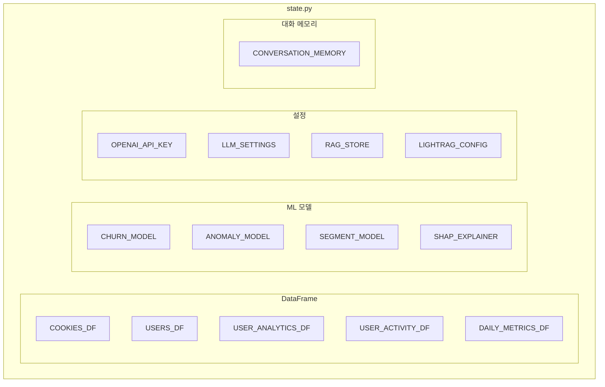

| 분류 | 변수 | 설명 |
|------|------|------|
| **DataFrame** | `COOKIES_DF` | 쿠키 캐릭터 (20개) |
| | `USERS_DF` | 유저 기본 정보 (1,000명) |
| | `USER_ANALYTICS_DF` | 유저 분석 결과 (세그먼트, 이상치, 이탈확률) |
| | `USER_ACTIVITY_DF` | 유저 일별 활동 (90일 × 1,000명) |
| | `DAILY_METRICS_DF` | 일별 KPI (DAU, ARPU, 매출) |
| **모델** | `CHURN_MODEL` | 이탈 예측 (RandomForest) |
| | `ANOMALY_MODEL` | 이상 탐지 (IsolationForest) |
| | `USER_SEGMENT_MODEL` | 유저 세그먼트 (K-Means, 5개 클러스터) |
| | `SHAP_EXPLAINER_CHURN` | 이탈 예측 SHAP 설명기 |
| **설정** | `OPENAI_API_KEY` | API 키 (환경변수 > 파일) |
| | `CUSTOM_LLM_SETTINGS` | 모델, temperature, maxTokens |
| | `LIGHTRAG_CONFIG` | top_k, context_max_chars |
| **메모리** | `CONVERSATION_MEMORY` | 세션별 대화 기록 (최대 10턴) |

---

## 3. AI 에이전트 시스템

### 3.1 아키텍처

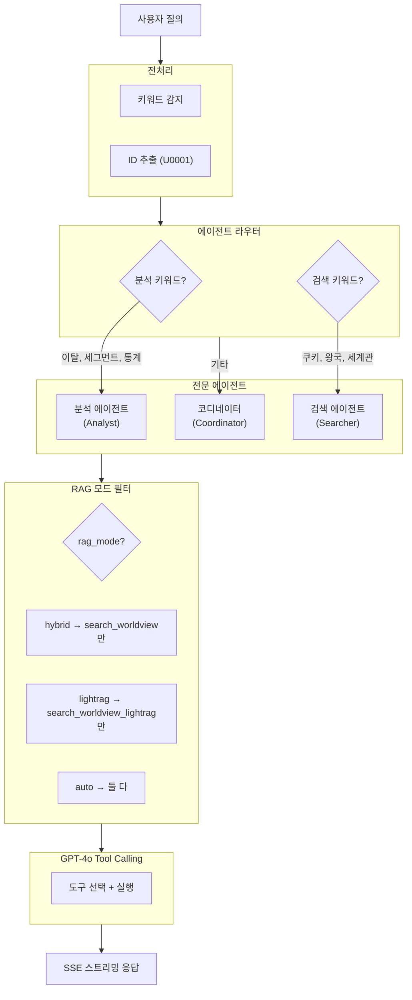

### 3.2 에이전트 상세

| 에이전트 | 역할 | 모델 | 트리거 키워드 |
|----------|------|------|--------------|
| **Analyst** | 유저/게임 데이터 분석 | GPT-4o-mini | 분석, 통계, 세그먼트, 이탈, 이상 탐지, 매출 |
| **Searcher** | 세계관 정보 검색 | GPT-4o-mini | 쿠키, 왕국, 스킬, 세계관, 스토리 |
| **Coordinator** | 복잡한 요청 조율 | GPT-4o | 기타 일반 질문, 대시보드 |

### 3.3 RAG 모드 선택

프론트엔드 설정에서 AI 에이전트의 세계관 검색 방식을 선택합니다.

| 모드 | 도구 | 설명 |
|------|------|------|
| `hybrid` | `search_worldview` | FAISS + BM25 + RRF 융합 |
| `lightrag` | `search_worldview_lightrag` | 지식 그래프 기반 검색 |
| `auto` | 둘 다 | AI가 질문에 맞게 자동 선택 |

**백엔드 처리 흐름:**
```
POST /api/agent/stream
  ↓ body: { message, username, rag_mode }
  ↓
rag_mode == "auto"    → 두 RAG 도구 모두 LLM에 제공
rag_mode == "hybrid"  → search_worldview만 제공
rag_mode == "lightrag"→ search_worldview_lightrag만 제공
  ↓
LLM이 질문에 적합한 도구 선택 → 실행 → SSE 응답
```

### 3.4 3단계 인텐트 라우터

> **출처**: [Anthropic - Building Effective Agents](https://www.anthropic.com/research/building-effective-agents)

**문제**: 28개 도구를 한 번에 노출하면 LLM이 잘못된 도구 선택 (예: 분석 질문에 RAG 호출)

**해결**: 3단계 Router 패턴으로 빠르고 정확한 분류

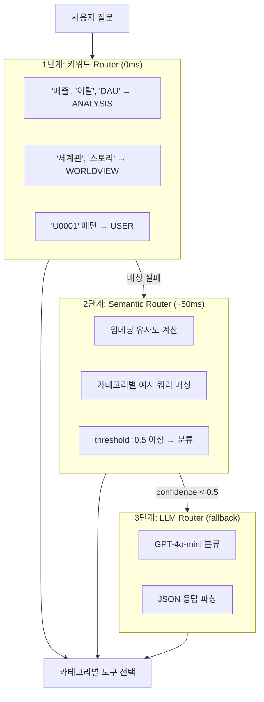

**구현 위치**:
- `agent/router.py` - 키워드 분류 + LLM Router
- `agent/semantic_router.py` - 임베딩 기반 분류
- `agent/intent.py` - 인텐트 감지 + 결정적 도구 실행

### 3.4.1 Semantic Router 상세

> **출처**: [semantic-router](https://github.com/aurelio-labs/semantic-router)

LLM 호출 없이 **임베딩 유사도**만으로 빠른 분류:

```python
# agent/semantic_router.py

ROUTE_EXAMPLES = {
    IntentCategory.ANALYSIS: [
        "매출 성장률 알려줘",
        "이탈률 얼마야?",
        "DAU 추이 분석해줘",
        "코호트 리텐션 현황",
        # ... 20+ 예시
    ],
    IntentCategory.WORLDVIEW: [
        "쿠키런 세계관 배경이 뭐야?",
        "소울잼이 뭐야?",
        "다크카카오 왕국 역사",
        # ... 20+ 예시
    ],
    # ... 7개 카테고리
}
```

**특징**:
- 서버 시작 시 예시 쿼리 임베딩 사전 계산
- 쿼리 ↔ 예시 코사인 유사도로 분류
- LLM 호출 없이 ~50ms 응답

### 3.4.2 인텐트 감지 (결정적 실행)

`agent/intent.py`에서 키워드 기반 **결정적 도구 실행**:

```python
def detect_intent(user_text: str) -> Dict[str, bool]:
    return {
        "want_cookie_info": ("쿠키" in t) and ("정보" in t),
        "want_translate": ("번역" in t) or ("영어로" in t),
        "want_rag": any(x in t for x in ["세계관", "스토리", "정의"]),
        "want_analytics": any(kw in t for kw in ["매출", "이탈", "DAU"]),
        # ...
    }

def run_deterministic_tools(user_text: str) -> Dict[str, Any]:
    intents = detect_intent(user_text)
    if intents["want_dashboard"]:
        return {"dashboard": tool_get_dashboard_summary()}
    if intents["want_rag"]:
        return {"rag_search": tool_rag_search(user_text, top_k=5)}
    # ...
```

**장점**: 간단한 질문은 LLM 없이 즉시 도구 실행 → 응답 속도 향상

#### 카테고리별 도구 매핑

| 카테고리 | 키워드 | 도구 | 비고 |
|----------|--------|------|------|
| `analysis` | 매출, 이탈, DAU, 코호트 | `get_churn_prediction`, `get_revenue_prediction`, `get_trend_analysis`, `get_cohort_analysis` | |
| `worldview` | 세계관, 스토리, 시대적, 기원, 탄생 | `search_worldview`, `search_worldview_lightrag` | **tool_choice="required"** |
| `cookie` | 쿠키, 승률, 투자 | `get_cookie_info`, `get_cookie_win_rate`, `optimize_investment`, ... | |
| `user` | 유저, 세그먼트, U0001 | `analyze_user`, `predict_user_churn`, `detect_user_anomaly`, ... | |
| `translate` | 번역, 품질 | `translate_text`, `check_translation_quality`, ... | |
| `dashboard` | 대시보드, 현황 | `get_dashboard_summary`, `get_segment_statistics`, ... | |
| `general` | 안녕, 고마워 | (도구 없음 - 직접 대화) | |

#### 분류 우선순위

```python
# agent/router.py - _keyword_classify()
def _keyword_classify(text: str) -> Optional[IntentCategory]:
    # 1. 분석 키워드 (최우선) - RAG 호출 방지
    if any(kw in t for kw in ["매출", "이탈", "DAU", "코호트"]):
        return IntentCategory.ANALYSIS

    # 2. 유저 분석 (U0001 패턴 감지)
    if re.search(r'U\d{4,6}', text):
        return IntentCategory.USER

    # 3. 세계관 (스토리, 용어, 시대적 배경)
    if any(kw in t for kw in ["세계관", "스토리", "시대적", "기원", "탄생"]):
        return IntentCategory.WORLDVIEW

    # 4. 키워드 분류 실패 → Semantic Router → LLM Router (fallback)
    return None
```

#### WORLDVIEW 강제 RAG (tool_choice="required")

> **문제**: 세계관 질문에서 LLM이 자체 지식으로 답변 → 부정확/할루시네이션

> **해결**: WORLDVIEW 카테고리일 때 `tool_choice="required"` 적용 → RAG 도구 강제 호출

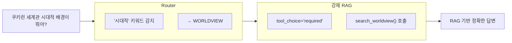

**구현 위치**:
- `agent/runner.py` (동기 에이전트)
- `api/routes.py` (스트리밍 에이전트)

```python
# WORLDVIEW 카테고리: RAG 도구 호출 강제
if category == IntentCategory.WORLDVIEW:
    llm_with_tools = llm.bind_tools(filtered_tools, tool_choice="required")
```

#### 성능 최적화

| 최적화 | 설명 |
|--------|------|
| **키워드 우선** | LLM 호출 없이 빠른 분류 (대부분 여기서 처리) |
| **Semantic Router** | 임베딩 유사도 기반 분류 (LLM 호출 없음) |
| **LLM Fallback** | 키워드/Semantic 분류 실패 시만 gpt-4o-mini 호출 |
| **RAG 스킵** | `analysis`, `user`, `cookie` 카테고리는 RAG 검색 완전 스킵 |
| **WORLDVIEW 강제 RAG** | `tool_choice="required"`로 LLM 자체 지식 사용 방지 |
| **GENERAL 모드** | 인사/단답은 도구 없이 직접 LLM 응답 |

### 3.5 도구 함수 목록 (28개)

| # | 도구명 | 설명 | 에이전트 |
|---|--------|------|----------|
| 1 | `get_cookie_info` | 쿠키 정보 조회 | Searcher |
| 2 | `list_cookies` | 쿠키 목록 (필터) | Searcher |
| 3 | `get_cookie_skill` | 쿠키 스킬 정보 | Searcher |
| 4 | `get_kingdom_info` | 왕국 정보 조회 | Searcher |
| 5 | `list_kingdoms` | 왕국 목록 | Searcher |
| 6 | `search_worldview` | Hybrid RAG 검색 | Searcher |
| 7 | `search_worldview_lightrag` | LightRAG 검색 | Searcher |
| 8 | `translate_text` | 텍스트 번역 | Searcher |
| 9 | `check_translation_quality` | 번역 품질 예측 | Searcher |
| 10 | `analyze_user` | 유저 종합 분석 | Analyst |
| 11 | `get_user_segment` | 세그먼트 예측 | Analyst |
| 12 | `detect_user_anomaly` | 이상 탐지 실행 | Analyst |
| 13 | `get_segment_statistics` | 세그먼트별 통계 | Analyst |
| 14 | `get_anomaly_statistics` | 이상 유저 통계 | Analyst |
| 15 | `predict_user_churn` | 개별 유저 이탈 예측 | Analyst |
| 16 | `get_churn_prediction` | 이탈 예측 (전체) | Analyst |
| 17 | `get_cohort_analysis` | 코호트 리텐션 분석 | Analyst |
| 18 | `get_trend_analysis` | KPI 트렌드 분석 | Analyst |
| 19 | `get_revenue_prediction` | 매출 예측 | Analyst |
| 20 | `predict_cookie_win_rate` | 쿠키 승률 예측 | Analyst |
| 21 | `get_cookie_win_rate` | 쿠키 승률 조회 | Analyst |
| 22 | `optimize_investment` | P-PSO 투자 최적화 | Analyst |
| 23 | `get_user_activity_report` | 유저 활동 리포트 | Analyst |
| 24 | `get_event_statistics` | 이벤트 통계 | Analyst |
| 25 | `classify_text` | 텍스트 카테고리 분류 | Analyst |
| 26 | `get_worldview_terms` | 세계관 용어 조회 | Searcher |
| 27 | `get_translation_statistics` | 번역 통계 | Searcher |
| 28 | `get_dashboard_summary` | 대시보드 요약 | Coordinator |

### 3.6 대화 메모리

| 설정 | 값 | 설명 |
|------|-----|------|
| `MAX_MEMORY_TURNS` | 10 | 세션당 최대 대화 턴 |
| `LAST_CONTEXT_TTL_SEC` | 600 | 컨텍스트 캐시 유효시간 |

```python
CONVERSATION_MEMORY = {
    "username": [
        {"role": "user", "content": "질문"},
        {"role": "assistant", "content": "답변"},
        # ... 최대 10턴, 초과 시 오래된 것부터 삭제
    ]
}
```

---

## 4. RAG 시스템

### 4.1 적용 기법 요약

| 기법 | 효과 | 런타임 추가 |
|------|------|-------------|
| **Hybrid Search** | 의미 + 키워드 검색 결합 | ~30ms |
| **Contextual Retrieval** | 검색 정확도 +20~35% | 인덱싱 시 |
| **RAG-Fusion** | 다중 쿼리로 리콜 향상 | ~50ms (LLM) |
| **Cross-Encoder Reranking** (비활성) | 정확도 +20~35% | ~80ms |
| **Parent-Child Chunking** | 정밀 검색 + 충분한 컨텍스트 | 0ms |
| **LightRAG** | 경량 지식그래프 | ~100ms |

### 4.2 Hybrid Search (FAISS + BM25)

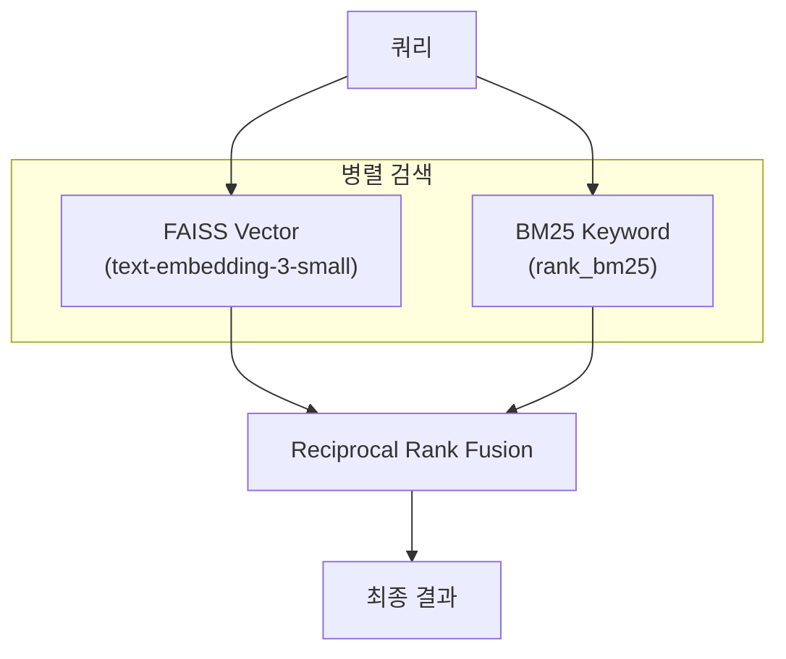

- **Vector Search**: 의미적 유사도 (코사인 거리)
- **BM25**: 정확한 키워드 매칭 (TF-IDF 기반)
- **RRF**: 두 결과를 순위 기반으로 융합

### 4.3 RAG-Fusion (Multi-Query)

단일 쿼리를 LLM으로 4개 변형 쿼리로 확장 후 병렬 검색:

```
원본: "용감한 쿠키 스킬"
  ↓ GPT-4o-mini 확장
  ├─ "용감한 쿠키의 스킬 정보"
  ├─ "GingerBrave Cookie skill"
  ├─ "용감한 쿠키 능력"
  └─ "쿠키런 용감한 쿠키 특기"
  ↓ 각각 검색 → RRF 병합
최종 결과
```

### 4.4 Contextual Retrieval

> **출처**: [Anthropic Blog](https://www.anthropic.com/news/contextual-retrieval) | 검색 정확도 +20~35%

인덱싱 시점에 각 청크에 **LLM 생성 컨텍스트**를 추가하여 검색 품질 향상:

```
원본 청크:
"그는 기업을 인수했다"

↓ GPT-4o-mini 컨텍스트 생성

컨텍스트 추가된 청크:
"[문서: 다크카카오 왕국 역사] [섹션: 3. 왕위 계승]
이 청크는 다크카카오 쿠키가 왕국을 되찾는 내용입니다.
그는 기업을 인수했다"
```

**구현**: `rag/service.py` - `_generate_contextual_prefix()`

| 시점 | 처리 |
|------|------|
| **인덱싱** | LLM으로 각 청크에 문맥 prefix 생성 (1회) |
| **검색** | 추가 비용 없음 (prefix가 이미 포함됨) |

### 4.5 Parent-Child Chunking

작은 청크(Child)로 정밀 검색, 큰 청크(Parent)로 충분한 컨텍스트 반환:

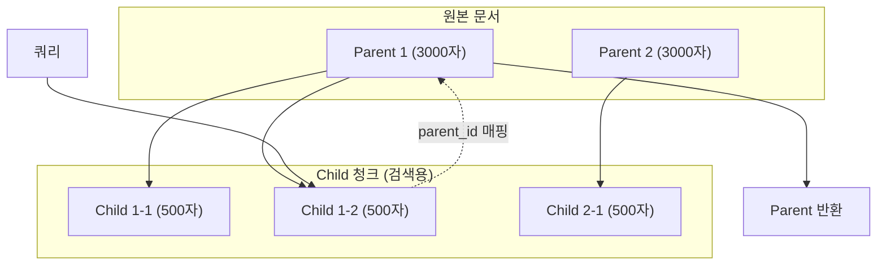

| 레벨 | 크기 | 용도 |
|------|------|------|
| **Parent** | 3,000자 | 최종 반환 (충분한 문맥) |
| **Child** | 500자 | 검색 인덱싱 (정밀 매칭) |

**장점**: 검색은 정밀하게, 반환은 풍부하게

### 4.6 LightRAG (지식 그래프)

> **출처**: [LightRAG Paper](https://arxiv.org/abs/2410.05779) | 99% 토큰 절감

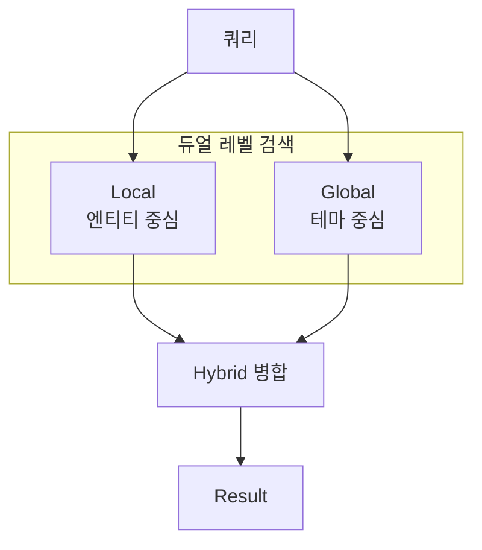

| 모드 | 용도 | 예시 |
|------|------|------|
| `local` | 구체적 엔티티 | "용감한 쿠키 스킬은?" |
| `global` | 추상적 테마 | "쿠키런 세계관 배경은?" |
| `hybrid` | 조합 (권장) | 대부분의 질문 |

### 4.7 LightRAG 성능 최적화

| 최적화 | 설명 |
|--------|------|
| **검색 캐싱** | TTL 5분, 최대 100개 항목 |
| **쿼리 정규화** | 대소문자/공백/물음표 통일 → 캐시 히트율 향상 |
| **단순 쿼리 스킵** | 인사, 단답, 3글자 이하 → RAG 호출 생략 |
| **OpenAI 클라이언트 싱글톤** | 연결 오버헤드 감소 |

```python
# 단순 쿼리 스킵 패턴
_SIMPLE_QUERY_PATTERNS = [
    r'^(안녕|하이|헬로|hi|hello)',  # 인사
    r'^(네|응|예|ok|yes|no)$',      # 단답
    r'^.{1,3}$',                     # 3글자 이하
]
```

### 4.8 문서 소스

`rag_docs/` 폴더의 **나무위키 PDF 8개** (총 46MB):

| 파일 | 내용 |
|------|------|
| `쿠키런_ 킹덤 - 나무위키.pdf` | 게임 메인 문서 |
| `쿠키런_ 킹덤_설정 - 나무위키.pdf` | 세계관 설정 |
| `쿠키런_ 킹덤_쿠키_스킨 - 나무위키.pdf` | 스킨 정보 |
| ... | 토핑, 보물, 게임 요소 등 |

### 4.9 K²RAG (개발 중)

> **출처**: [arxiv:2507.07695](https://arxiv.org/abs/2507.07695) (July 2025)

K²RAG는 Knowledge Graph + Hybrid Search + Corpus Summarization을 결합한 고급 RAG:

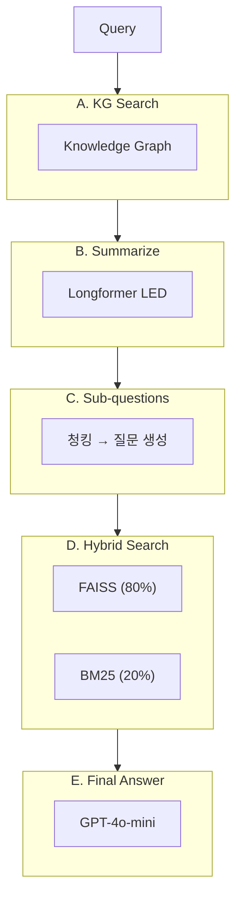

**핵심 특징**:

| 특징 | 설명 | 효과 |
|------|------|------|
| **Corpus Summarization** | 인덱싱 시 문서 요약 | 학습 시간 93% 감소 |
| **Hybrid Search** | λ=0.8 (Dense 80% + Sparse 20%) | 정확도 + 리콜 균형 |
| **Sub-question Generation** | KG 결과에서 서브 질문 생성 | 복잡한 질문 분해 |
| **Longformer LED** | `pszemraj/led-base-book-summary` | 긴 문서 요약 (GPU 지원) |

**API 엔드포인트**:

| Method | Endpoint | 설명 |
|--------|----------|------|
| POST | `/api/k2rag/search` | K²RAG 검색 |
| GET | `/api/k2rag/status` | K²RAG 상태 |
| POST | `/api/k2rag/config` | 설정 업데이트 |

**설정 옵션**:

```python
K2RAGConfig(
    hybrid_lambda=0.8,        # Dense 비중 (80%)
    top_k=10,                 # 검색 결과 수
    use_summarization=True,   # 요약 사용
    use_knowledge_graph=True, # KG 사용
    llm_model="gpt-4o-mini",  # LLM 모델
)
```

**구현 위치**: `rag/k2rag.py`

---

## 5. ML 모델

### 5.1 모델 개요

| 모델 | 알고리즘 | 용도 | 출력 |
|------|---------|------|------|
| **이탈 예측** | RandomForest | 유저 이탈 확률 | 확률 (0~1) + SHAP |
| **이상 탐지** | Isolation Forest | 어뷰징/봇 탐지 | 정상(1)/이상(-1) |
| **유저 세그먼트** | K-Means | 유저 유형 분류 | 클러스터 ID (0~4) |
| **번역 품질** | Random Forest | 번역 품질 점수 | 점수 (0~1) |
| **승률 예측** | LightGBM | PvP 승률 예측 | 승률 (0~1) |

### 5.2 이탈 예측 + SHAP 해석

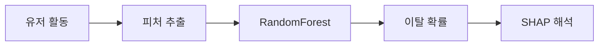

**SHAP 출력 예시:**
```
U000123 이탈 예측: 73% (high)

피처                         SHAP     영향
────────────────────────────────────────
days_since_last_login (14일)  +0.35   이탈↑
playtime (↓감소)              +0.22   이탈↑
total_events (높음)           -0.12   이탈↓
```

### 5.3 유저 세그먼트 (K-Means)

| ID | 세그먼트 | 특징 |
|----|----------|------|
| 0 | 캐주얼 유저 | 가벼운 플레이, 낮은 과금 |
| 1 | 하드코어 게이머 | 높은 스테이지, 긴 플레이타임 |
| 2 | PvP 전문가 | 높은 PvP 전투 수 |
| 3 | 콘텐츠 수집가 | 높은 가챠 뽑기 |
| 4 | 신규 유저 | 낮은 레벨, 짧은 가입 기간 |

### 5.4 투자 최적화 (P-PSO)

자원 제약 하에서 승률 증가 최대화:

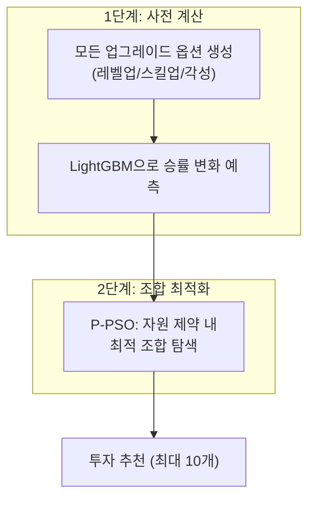

| 파라미터 | 값 |
|----------|-----|
| `epoch` | 200 |
| `pop_size` | 50 |
| `bounds` | BinaryVar (0/1) |

### 5.5 모델 파일

| 파일명 | 설명 |
|--------|------|
| `model_churn.pkl` | 이탈 예측 |
| `model_anomaly.pkl` | 이상 탐지 |
| `model_user_segment.pkl` | 유저 세그먼트 |
| `model_translation_quality.pkl` | 번역 품질 |
| `model_win_rate.pkl` | 승률 예측 |
| `shap_explainer_churn.pkl` | SHAP 설명기 |
| `tfidf_vectorizer.pkl` | 텍스트 벡터화 |
| `scaler_*.pkl` | 피처 스케일러 |

---

## 6. 데이터 생성

### 6.1 합성 데이터 생성 (train_models.py)

프로젝트는 실제 데이터 없이도 동작하도록 **합성 데이터**를 생성합니다.

```bash
python ml/train_models.py
```

### 6.2 생성되는 CSV 파일

| 파일명 | 행 수 | 설명 |
|--------|-------|------|
| `cookies.csv` | 20 | 쿠키 캐릭터 (이름, 등급, 타입, 스토리) |
| `cookie_stats.csv` | 20 | 쿠키 스탯 (ATK, HP, DEF, 승률) |
| `kingdoms.csv` | 8 | 왕국/지역 정보 |
| `skills.csv` | 20 | 쿠키 스킬 정보 |
| `users.csv` | 1,000 | 유저 기본 정보 (ID, 닉네임, 레벨, 가입일) |
| `user_analytics.csv` | 1,000 | 유저 분석 결과 (세그먼트, 이상치, 이탈확률) |
| `user_activity.csv` | 90,000 | 유저 일별 활동 (90일 × 1,000명) |
| `user_cookies.csv` | ~5,000 | 유저별 보유 쿠키 |
| `user_resources.csv` | 1,000 | 유저 자원 (코인, 젤리, 소울스톤) |
| `game_logs.csv` | ~2,000,000 | 게임 이벤트 로그 |
| `daily_metrics.csv` | 90 | 일별 KPI (DAU, ARPU, 매출) |
| `cohort_retention.csv` | 16 | 코호트 리텐션 |
| `anomaly_details.csv` | ~260 | 이상 유저 상세 |
| `translations.csv` | ~500 | 번역 데이터 |

### 6.3 데이터 생성 규칙

#### 유저 피처 (정규분포 기반)

| 피처 | 분포 | 설명 |
|------|------|------|
| `total_events` | N(500, 200) | 총 이벤트 수 |
| `stage_clears` | N(100, 50) | 스테이지 클리어 수 |
| `gacha_pulls` | N(30, 15) | 가챠 뽑기 수 |
| `pvp_battles` | N(50, 30) | PvP 전투 수 |
| `purchases` | N(5, 3) | 구매 횟수 |

#### 세그먼트별 특성 조정

```python
SEGMENT_ADJUSTMENTS = {
    "hardcore": {"total_events": 1.5, "stage_clears": 1.8},
    "pvp_expert": {"pvp_battles": 2.5, "stage_clears": 1.3},
    "collector": {"gacha_pulls": 2.0, "purchases": 1.5},
    "casual": {"total_events": 0.6, "purchases": 0.5},
    "newbie": {"total_events": 0.3, "stage_clears": 0.2},
}
```

#### 이탈 확률 계산

```python
# 이탈 위험 요인
churn_risk = (
    days_since_login * 0.03 +     # 미접속 일수
    (1 - playtime_ratio) * 0.2 +  # 플레이타임 감소
    (1 - event_ratio) * 0.15      # 이벤트 참여 감소
)
```

#### 이상 유저 생성

전체 유저의 **~26%**를 이상 유저로 설정:

| 이상 유형 | 비율 | 특징 |
|----------|------|------|
| 봇 의심 | 10% | events > 1500, 비정상적 패턴 |
| 어뷰징 의심 | 8% | gacha > 100, purchases < 2 |
| 핵 의심 | 5% | stage_clears > 300, events < 200 |
| 사기 의심 | 3% | purchases > 20, vip < 2 |

---

## 7. API 엔드포인트

### 인증/헬스

| Method | Endpoint | 설명 |
|--------|----------|------|
| POST | `/api/login` | 로그인 (Basic Auth) |
| GET | `/api/health` | 헬스체크 |

### 세계관

| Method | Endpoint | 설명 |
|--------|----------|------|
| GET | `/api/cookies` | 쿠키 목록 |
| GET | `/api/cookies/{id}` | 쿠키 상세 |
| GET | `/api/cookies/{id}/skill` | 쿠키 스킬 |
| GET | `/api/kingdoms` | 왕국 목록 |
| GET | `/api/kingdoms/{id}` | 왕국 상세 |

### 유저 분석

| Method | Endpoint | 설명 |
|--------|----------|------|
| GET | `/api/users` | 유저 목록 |
| GET | `/api/users/search` | 유저 검색 |
| GET | `/api/users/analyze/{id}` | 유저 종합 분석 |
| POST | `/api/users/segment` | 세그먼트 예측 |
| POST | `/api/users/anomaly` | 이상 탐지 |
| GET | `/api/users/segments/statistics` | 세그먼트 통계 |

### 분석

| Method | Endpoint | 설명 |
|--------|----------|------|
| GET | `/api/analysis/anomaly` | 이상 유저 전체 |
| GET | `/api/analysis/prediction/churn` | 이탈 예측 전체 |
| GET | `/api/analysis/prediction/churn/user/{id}` | 개별 이탈 예측 |
| GET | `/api/analysis/cohort/retention` | 코호트 리텐션 |
| GET | `/api/analysis/trend/kpis` | KPI 트렌드 |

### 대시보드

| Method | Endpoint | 설명 |
|--------|----------|------|
| GET | `/api/dashboard/summary` | 대시보드 KPI |
| GET | `/api/dashboard/insights` | AI 인사이트 |
| GET | `/api/stats/summary` | 통계 요약 |

### RAG

| Method | Endpoint | 설명 |
|--------|----------|------|
| POST | `/api/rag/search` | 벡터 검색 |
| POST | `/api/rag/search/hybrid` | Hybrid Search |
| GET | `/api/rag/status` | RAG 상태 |
| POST | `/api/rag/upload` | 문서 업로드 |
| POST | `/api/rag/reload` | 인덱스 재빌드 |

### LightRAG

| Method | Endpoint | 설명 |
|--------|----------|------|
| POST | `/api/lightrag/search` | LightRAG 검색 |
| POST | `/api/lightrag/search-dual` | 듀얼 검색 (모든 모드) |
| POST | `/api/lightrag/build` | 지식 그래프 빌드 |
| GET | `/api/lightrag/status` | LightRAG 상태 |

### K²RAG

| Method | Endpoint | 설명 |
|--------|----------|------|
| POST | `/api/k2rag/search` | K²RAG 검색 (KG + Hybrid + Summary) |
| GET | `/api/k2rag/status` | K²RAG 상태 |
| POST | `/api/k2rag/config` | K²RAG 설정 업데이트 |
| POST | `/api/k2rag/load` | 기존 RAG 데이터 로드 |

### AI 에이전트

| Method | Endpoint | 설명 |
|--------|----------|------|
| POST | `/api/agent/chat` | 동기 응답 |
| POST | `/api/agent/stream` | **SSE 스트리밍** |
| POST | `/api/agent/memory/clear` | 대화 메모리 초기화 |

#### SSE 스트리밍 상세 (`/api/agent/stream`)

**요청:**
```json
{
  "message": "이탈 예측 분석해줘",
  "username": "admin",
  "rag_mode": "auto"
}
```

**응답 헤더:**
```
Content-Type: text/event-stream
Cache-Control: no-cache
Connection: keep-alive
X-Accel-Buffering: no
```

**이벤트 흐름:**
```
event: tool_start
data: {"tool": "get_churn_prediction"}

event: tool_end
data: {"tool": "get_churn_prediction", "result": {...}}

event: delta
data: {"content": "이탈"}

event: delta
data: {"content": " 예측"}

event: done
data: {"full_response": "...", "tool_calls": ["get_churn_prediction"]}
```

**구현 메커니즘:**
- LangGraph `astream_events` (v2) 사용
- 클라이언트 연결 단절 감지: `request.is_disconnected()`
- RAG 모드에 따른 도구 필터링

**클라이언트 연결 (JavaScript):**
```javascript
const eventSource = new EventSource('/api/agent/stream', {
  method: 'POST',
  body: JSON.stringify({ message, username, rag_mode })
});

eventSource.addEventListener('delta', (e) => {
  const { content } = JSON.parse(e.data);
  appendToResponse(content);
});

eventSource.addEventListener('done', (e) => {
  eventSource.close();
});
```

### MLflow

| Method | Endpoint | 설명 |
|--------|----------|------|
| GET | `/api/mlflow/experiments` | 실험 목록 |
| GET | `/api/mlflow/models` | 모델 레지스트리 |
| POST | `/api/mlflow/models/select` | 모델 선택/적용 |

#### MLflow 실험 추적

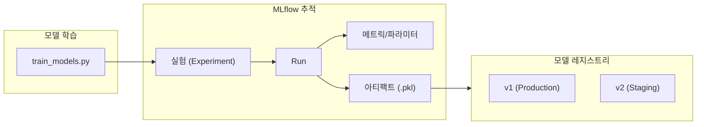

**추적되는 항목:**

| 항목 | 예시 |
|------|------|
| **파라미터** | `n_estimators=100`, `max_depth=10` |
| **메트릭** | `accuracy=0.85`, `f1_score=0.82` |
| **아티팩트** | `model_churn.pkl`, `shap_explainer.pkl` |

**실험 구조:**
```
mlruns/
├── 0/                          # Default 실험
├── 1/                          # cookierun-ai-platform
│   ├── meta.yaml
│   └── <run_id>/
│       ├── params/
│       ├── metrics/
│       └── artifacts/
│           └── model_churn.pkl
```

**모델 버전 관리:**

| 버전 | 상태 | 설명 |
|------|------|------|
| v1 | Production | 현재 운영 중 |
| v2 | Staging | 테스트 중 |
| v3 | Archived | 이전 버전 |

**프론트엔드 연동:**
- ML모델 패널에서 실험/모델 목록 조회
- 모델 버전 선택 시 `POST /api/mlflow/models/select`
- 선택된 모델이 실시간으로 state.py에 로드됨

### 설정

| Method | Endpoint | 설명 |
|--------|----------|------|
| GET/POST | `/api/settings/llm` | LLM 설정 |
| GET/POST | `/api/settings/prompt` | 시스템 프롬프트 |
| POST | `/api/settings/prompt/reset` | 프롬프트 초기화 |

### 에러 응답 형식

모든 API는 일관된 에러 응답 형식을 사용합니다:

```json
{
  "detail": "에러 메시지",
  "error_code": "ERROR_CODE"
}
```

**주요 에러 코드:**

| HTTP | 에러 코드 | 설명 |
|------|-----------|------|
| 400 | `INVALID_REQUEST` | 잘못된 요청 파라미터 |
| 401 | `UNAUTHORIZED` | 인증 실패 |
| 404 | `USER_NOT_FOUND` | 유저 ID 없음 |
| 404 | `COOKIE_NOT_FOUND` | 쿠키 ID 없음 |
| 500 | `MODEL_NOT_LOADED` | ML 모델 로드 실패 |
| 500 | `RAG_NOT_READY` | RAG 인덱스 미준비 |
| 500 | `OPENAI_ERROR` | OpenAI API 호출 실패 |

---

## 8. 환경 설정

### 환경 변수

| 변수 | 필수 | 설명 |
|------|------|------|
| `OPENAI_API_KEY` | ✅ | OpenAI API 키 (`openai_api_key.txt`로 대체 가능) |
| `MLFLOW_TRACKING_URI` | | MLflow 경로 (기본: `file:./mlruns`) |

### LLM 기본 설정

| 설정 | 기본값 |
|------|--------|
| `selectedModel` | `gpt-4o` |
| `temperature` | `0.3` |
| `maxTokens` | `4000` |
| `timeoutMs` | `30000` |

### RAG 설정

| 설정 | 기본값 |
|------|--------|
| `RAG_EMBED_MODEL` | `text-embedding-3-small` |
| `RAG_DEFAULT_TOPK` | `5` |
| `RAG_SNIPPET_CHARS` | `1200` |
| `LIGHTRAG_TOP_K` | `3` |

### Startup 초기화 순서

서버 시작 시 `@app.on_event("startup")`에서 실행되는 초기화 순서:

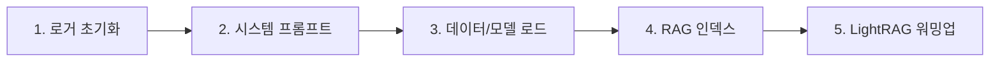

| 단계 | 함수 | 설명 | 실패 시 |
|------|------|------|---------|
| 1 | `setup_logging()` | 로거 설정, PID 기록 | 서버 중단 |
| 2 | `load_system_prompt()` | `system_prompt.json` 로드 | 기본값 사용 |
| 3 | `init_data_models()` | CSV, ML 모델 로드 | 서버 중단 |
| 4 | `rag_build_or_load_index()` | FAISS 인덱스 생성/로드 | 경고 후 계속 |
| 5 | LightRAG 워밍업 | 더미 쿼리로 콜드스타트 방지 | 경고 후 계속 |

**LightRAG 워밍업:**
```python
# 첫 쿼리 지연 방지를 위한 사전 로딩
await lightrag_instance.aquery("warmup", param=QueryParam(mode="naive"))
```

### 실행

```bash
# 개발
uvicorn main:app --reload --port 8000

# 프로덕션
uvicorn main:app --host 0.0.0.0 --port 8000 --workers 4
```

### Docker

```bash
docker build -t cookierun-backend .
docker run -d -p 8000:8000 -e OPENAI_API_KEY=your_key cookierun-backend
```

### 기본 계정

| 사용자 | 비밀번호 | 역할 |
|--------|----------|------|
| `admin` | `admin123` | 관리자 |
| `analyst` | `analyst123` | 분석가 |
| `user` | `user123` | 일반 |

---

## 9. Core 모듈

`core/` 폴더는 프로젝트 전반에서 사용되는 핵심 유틸리티를 제공합니다.

### 9.1 constants.py

| 상수 | 설명 |
|------|------|
| `COOKIE_GRADES` | 쿠키 등급 (커먼 ~ 에인션트) |
| `COOKIE_TYPES` | 쿠키 타입 (돌격, 마법, 사격 등 8종) |
| `SUPPORTED_LANGUAGES` | 지원 언어 (ko, en, ja, zh 등 11개) |
| `WORLDVIEW_TERMS` | 세계관 고유 용어 (젤리, 소울잼, 오븐 등) |
| `FEATURE_COLS_*` | ML 피처 컬럼 정의 |
| `ML_MODEL_INFO` | 모델 메타데이터 (이름, 알고리즘, 메트릭) |
| `USER_SEGMENT_NAMES` | 세그먼트 이름 (0~4) |
| `DEFAULT_SYSTEM_PROMPT` | 기본 시스템 프롬프트 |
| `TRANSLATION_SYSTEM_PROMPT` | 번역 전용 프롬프트 |
| `SUMMARY_TRIGGERS` | 요약 트리거 키워드 |

### 9.2 utils.py

| 함수 | 설명 |
|------|------|
| `safe_str(obj)` | None-safe 문자열 변환 |
| `safe_int(obj, default)` | None-safe 정수 변환 |
| `json_sanitize(obj)` | LangChain 객체 → JSON 직렬화 가능 형태 |

### 9.3 memory.py

대화 메모리 관리:

| 함수 | 설명 |
|------|------|
| `append_memory(username, role, content)` | 메모리에 메시지 추가 |
| `clear_memory(username)` | 특정 유저 메모리 초기화 |
| `get_memory(username)` | 메모리 조회 (최대 10턴) |

### 9.4 parsers.py

PDF/텍스트 파서:

| 함수 | 설명 |
|------|------|
| `clean_namuwiki_pdf_noise(text)` | 나무위키 PDF 노이즈 제거 |
| `normalize_bullet_items(text)` | 불릿 항목 표준화 |
| `restore_word_breaks(text)` | 단어 중간 줄바꿈 복원 |

---

<div align="center">

**Version 5.7.0** · 2026-02-05

</div>
