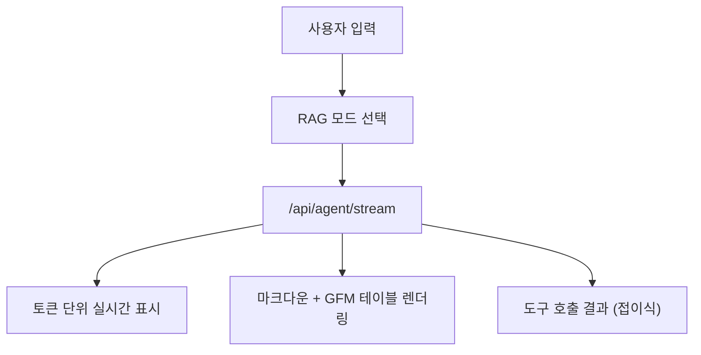
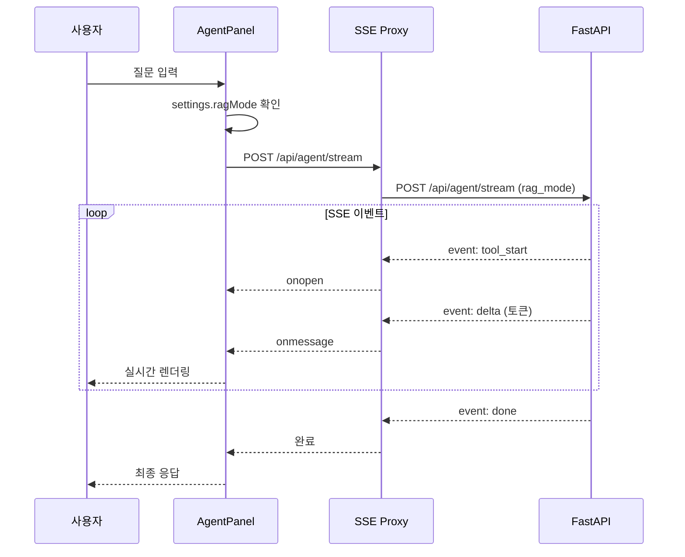

# CookieRun AI Platform - Frontend

<div align="center">

**Next.js 기반 쿠키런 AI 에이전트 분석 플랫폼 UI**

[](https://nextjs.org)
[](https://react.dev)
[](https://tailwindcss.com)

</div>

---

## 목차

1. [프로젝트 구조](#1-프로젝트-구조)
2. [패널 (8개)](#2-패널-8개)
3. [컴포넌트](#3-컴포넌트)
4. [API 통신](#4-api-통신)
5. [상태 관리](#5-상태-관리)
6. [디자인 시스템](#6-디자인-시스템)
7. [환경 설정](#7-환경-설정)

---

## 1. 프로젝트 구조

```
nextjs/
│
├── pages/                          # Next.js 페이지 라우팅
│   ├── _app.js                     # App 진입점 (NProgress, Toast)
│   ├── index.js                    # 랜딩 페이지 (세션 체크)
│   ├── login.js                    # 로그인 페이지
│   ├── app.js                      # 메인 앱 (탭 기반 패널 라우팅)
│   └── api/agent/
│       └── stream.js               # SSE 프록시 (백엔드 → 클라이언트)
│
├── components/                     # React 컴포넌트
│   ├── Layout.js                   # 12-column 그리드 레이아웃
│   ├── Sidebar.js                  # 쿠키/왕국 선택, 예시 질문
│   ├── Topbar.js                   # 사용자 정보, 로그아웃
│   ├── Tabs.js                     # 탭 네비게이션
│   ├── KpiCard.js                  # KPI 지표 카드
│   ├── EmptyState.js               # 빈 상태 UI
│   │
│   └── panels/                     # 기능별 패널 (메인 콘텐츠)
│       ├── AgentPanel.js           # AI 에이전트 채팅
│       ├── DashboardPanel.js       # 대시보드 (KPI, 차트)
│       ├── AnalysisPanel.js        # 상세 분석 (9개 탭)
│       ├── ModelsPanel.js          # MLflow 모델 관리
│       ├── RagPanel.js             # RAG 문서 관리
│       ├── SettingsPanel.js        # LLM/시스템 설정
│       ├── UsersPanel.js           # 사용자 관리
│       └── LogsPanel.js            # 활동 로그 뷰어
│
├── lib/                            # 유틸리티 함수
│   ├── api.js                      # API 호출 (Basic Auth, 타임아웃)
│   ├── storage.js                  # 로컬/세션 스토리지 관리
│   ├── cn.js                       # 클래스명 병합
│   └── cookieImages.js             # 쿠키 이미지 URL 매핑
│
├── styles/
│   ├── globals.css                 # 전역 스타일 (Tailwind + 커스텀)
│   └── nprogress.css               # 페이지 전환 진행바
│
├── next.config.js                  # Next.js 설정 (API 프록시)
├── tailwind.config.js              # Tailwind 커스텀 설정
└── package.json
```

---

## 2. 패널 (8개)

### 2.1 AgentPanel (AI 에이전트)

| 항목 | 내용 |
|------|------|
| **파일** | `components/panels/AgentPanel.js` |
| **역할** | AI 에이전트와 실시간 채팅, 도구 호출 결과 표시 |
| **API** | `POST /api/agent/stream` (SSE) |
| **라이브러리** | `@microsoft/fetch-event-source`, `react-markdown`, `remark-gfm` |



**RAG 모드 선택** (Settings에서 설정):

| 모드 | 설명 | 특징 |
|------|------|------|
| `hybrid` | FAISS + BM25 + RRF | 싱글홉 질문에 최적 |
| `lightrag` | 지식 그래프 기반 | 멀티홉 질문에 최적 |
| `auto` | AI가 자동 선택 | 두 RAG 도구 모두 제공 |

**예시 질문 카테고리:**

| 카테고리 | 예시 |
|----------|------|
| **쿠키 & 세계관** | "쿠키런 킹덤 세계관 배경이 뭐야?" |
| **번역** | "용감한 쿠키가 오븐에서 탈출했어요 영어로 번역" |
| **AI 예측 분석** | "U000001 유저 이탈 확률 예측해줘" |
| **비즈니스 KPI** | "최근 7일 KPI 트렌드 분석" |
| **유저 분석** | "유저 세그먼트별 통계 보여줘" |
| **투자 최적화** | "100만 코인으로 어떤 쿠키 육성해?" |

**UI 특징:**
- 쿠키런 브랜드 컬러 (amber/brown 테마)
- 진행 표시 애니메이션 (쿠키 바운스)
- 도구 실행 결과 접이식 표시
- 응답 복사 버튼
- GFM 테이블 지원 (마크다운)

---

### 2.2 DashboardPanel (대시보드)

| 항목 | 내용 |
|------|------|
| **파일** | `components/panels/DashboardPanel.js` |
| **역할** | 전체 플랫폼 KPI 및 통계 시각화 |
| **API** | `GET /api/dashboard/summary` |
| **라이브러리** | `recharts` (PieChart, BarChart, AreaChart) |

| 섹션 | 내용 | 차트 |
|------|------|------|
| **쿠키 통계** | 등급별 분포 | PieChart |
| **유저 통계** | 세그먼트별 분포 | RadialBarChart |
| **이벤트 통계** | 유형별 분포 | PieChart |
| **일일 활성 유저** | 7일간 DAU | AreaChart |

---

### 2.3 AnalysisPanel (상세 분석)

| 항목 | 내용 |
|------|------|
| **파일** | `components/panels/AnalysisPanel.js` |
| **역할** | 유저/쿠키 데이터 심층 분석 |
| **탭 수** | 9개 |
| **라이브러리** | `recharts` (LineChart, RadarChart, AreaChart, BarChart) |

| # | 탭 | 설명 | API | 차트 |
|---|-----|------|-----|------|
| 1 | **유저 분석** | 개별 유저 프로필 | `/api/users/search` | RadarChart |
| 2 | **세그먼트** | 5개 세그먼트별 통계 | `/api/users/segments/statistics` | BarChart |
| 3 | **이상탐지** | 이상 유저 목록, 점수 분포 | `/api/analysis/anomaly` | ScatterPlot |
| 4 | **예측 분석** | 이탈/매출/참여도 예측 | `/api/analysis/prediction/*` | AreaChart |
| 5 | **코호트** | 리텐션/LTV/전환율 | `/api/analysis/cohort/*` | HeatMap |
| 6 | **트렌드** | 일별/주별 KPI 추이 | `/api/analysis/trend/kpis` | LineChart |
| 7 | **쿠키 분석** | 쿠키별 사용률, PvP 승률 | `/api/cookies` | BarChart |
| 8 | **번역 분석** | 번역 품질, 언어별 분포 | `/api/translation/statistics` | PieChart |
| 9 | **투자 최적화** | P-PSO 쿠키 육성 추천 | `/api/investment/optimize` | Table |

**세그먼트 정의:**

| ID | 이름 | 특징 |
|----|------|------|
| 0 | 캐주얼 플레이어 | 가벼운 플레이, 낮은 과금 |
| 1 | 하드코어 게이머 | 높은 스테이지, 긴 플레이타임 |
| 2 | PvP 전문가 | 높은 PvP 전투 수 |
| 3 | 콘텐츠 수집가 | 높은 가챠 뽑기 |
| 4 | 신규 유저 | 낮은 레벨, 짧은 가입 기간 |

---

### 2.4 ModelsPanel (ML 모델 관리)

| 항목 | 내용 |
|------|------|
| **파일** | `components/panels/ModelsPanel.js` |
| **역할** | MLflow 모델 레지스트리 조회 및 버전 선택 |
| **API** | `/api/mlflow/models`, `/api/mlflow/experiments` |
| **권한** | 관리자 전용 |

**표시 모델:**

| 모델명 | 알고리즘 |
|--------|----------|
| 번역품질예측 | RandomForest |
| 유저세그먼트 | KMeans |
| 이상탐지 | IsolationForest |
| 이탈예측 | XGBoost + SHAP |
| 승률예측 | LightGBM |

---

### 2.5 RagPanel (RAG 문서 관리)

| 항목 | 내용 |
|------|------|
| **파일** | `components/panels/RagPanel.js` |
| **역할** | RAG 문서 업로드, 삭제, 인덱스 관리 |
| **API** | `/api/rag/*` |
| **권한** | 관리자 전용 |

| 기능 | API |
|------|-----|
| **파일 업로드** | `POST /api/rag/upload` |
| **문서 삭제** | `DELETE /api/rag/files/{filename}` |
| **재인덱싱** | `POST /api/rag/reindex` |
| **LightRAG 빌드** | `POST /api/lightrag/build` |

---

### 2.6 SettingsPanel (LLM 설정)

| 항목 | 내용 |
|------|------|
| **파일** | `components/panels/SettingsPanel.js` |
| **역할** | LLM 모델 및 파라미터 설정 |
| **API** | `/api/settings/llm`, `/api/settings/prompt` |
| **권한** | 관리자 전용 |

| 설정 | 타입 | 기본값 |
|------|------|--------|
| **selectedModel** | select | `gpt-4o` |
| **temperature** | slider | `0.3` |
| **maxTokens** | number | `4000` |
| **timeoutMs** | number | `30000` |

**LLM 프리셋:**

| 프리셋 | temperature | 설명 |
|--------|-------------|------|
| 정확한 응답 | 0.1 | 분석/데이터 작업 |
| 균형잡힌 | 0.5 | 일반 대화 |
| 창의적 | 0.9 | 아이디어/스토리텔링 |

---

### 2.7 UsersPanel (사용자 관리)

| 항목 | 내용 |
|------|------|
| **파일** | `components/panels/UsersPanel.js` |
| **역할** | 플랫폼 사용자 계정 관리 |
| **권한** | 관리자 전용 |

---

### 2.8 LogsPanel (활동 로그)

| 항목 | 내용 |
|------|------|
| **파일** | `components/panels/LogsPanel.js` |
| **역할** | 세션 내 활동 로그 조회 |
| **저장소** | localStorage |
| **권한** | 관리자 전용 |

---

## 3. 컴포넌트

### 레이아웃

| 컴포넌트 | 파일 | 설명 |
|----------|------|------|
| **Layout** | `Layout.js` | 12-column 그리드 (Sidebar 3열 + Main 9열) |
| **Sidebar** | `Sidebar.js` | 쿠키/왕국 선택, 예시 질문 |
| **Topbar** | `Topbar.js` | 사용자명, 역할, 로그아웃 버튼 |
| **Tabs** | `Tabs.js` | 역할별 필터링된 탭 네비게이션 |

### UI 컴포넌트

| 컴포넌트 | Props | 설명 |
|----------|-------|------|
| **KpiCard** | `title, value, icon, color, trend` | KPI 지표 카드 |
| **SectionHeader** | `title, subtitle, action` | 섹션 제목 + 액션 버튼 |
| **EmptyState** | `icon, title, message` | 데이터 없음 상태 |
| **Skeleton** | `width, height, className` | 로딩 스켈레톤 |

---

## 4. API 통신

### 4.1 API 호출 함수

```javascript
// lib/api.js
export async function apiCall({
  endpoint,           // API 경로 (예: '/api/cookies')
  method = 'GET',     // HTTP 메서드
  data = null,        // POST body
  auth = null,        // { username, password }
  timeoutMs = 60000,  // 타임아웃
}) {
  const options = {
    method,
    headers: {
      'Content-Type': 'application/json',
      ...(auth ? { 'Authorization': `Basic ${btoa(...)}` } : {}),
    },
  };
  // ...
}
```

### 4.2 SSE 스트리밍

```javascript
import { fetchEventSource } from '@microsoft/fetch-event-source';

await fetchEventSource('/api/agent/stream', {
  method: 'POST',
  body: JSON.stringify({ message }),
  onmessage: (event) => {
    const data = JSON.parse(event.data);
    if (data.type === 'token') {
      onToken(data.content);
    }
  },
});
```

**SSE 프록시 (`pages/api/agent/stream.js`):**

| 설정 | 설명 |
|------|------|
| `bodyParser: false` | POST 바디 원본 전달 |
| `responseLimit: false` | 스트리밍 크기 제한 없음 |
| `duplex: 'half'` | Node.js 18+ 스트림 필수 |

**SSE 이벤트 타입:**

| 이벤트 | 설명 | data 예시 |
|--------|------|-----------|
| `tool_start` | 도구 실행 시작 | `{"tool": "search_worldview"}` |
| `tool_end` | 도구 실행 완료 | `{"tool": "...", "result": {...}}` |
| `delta` | 토큰 스트리밍 | `{"content": "이탈"}` |
| `done` | 응답 완료 | `{"full_response": "...", "tool_calls": [...]}` |
| `error` | 오류 발생 | `{"message": "..."}` |

### 4.3 Next.js API 프록시

```javascript
// next.config.js
async rewrites() {
  const backend = process.env.BACKEND_INTERNAL_URL || 'http://127.0.0.1:8001';
  return [
    { source: '/api/agent/stream', destination: '/api/agent/stream' },
    { source: '/api/:path*', destination: `${backend}/api/:path*` },
  ];
}
```

---

## 5. 상태 관리

### 5.1 페이지 레벨 상태 (`pages/app.js`)

```javascript
// 인증
const [auth, setAuth] = useState(null);

// 데이터
const [cookies, setCookies] = useState([]);
const [selectedCookie, setSelectedCookie] = useState(null);

// LLM 설정
const [settings, setSettings] = useState({
  selectedModel: 'gpt-4o',
  temperature: 0.3,
  ragMode: 'lightrag',  // 'hybrid' | 'lightrag' | 'auto'
});

// AI 에이전트
const [agentMessages, setAgentMessages] = useState([]);
```

### 5.2 스토리지 키

| 키 | 저장소 | 용도 |
|----|-------|------|
| `cookierun_auth` | sessionStorage | 인증 정보 (탭 닫으면 만료) |
| `cookierun_settings` | localStorage | LLM 설정 (영구) |
| `cookierun_agent_messages` | localStorage | 채팅 히스토리 |
| `cookierun_activity_log` | localStorage | 활동 로그 |

---

## 6. 디자인 시스템

### 6.1 쿠키런 브랜드 컬러

```javascript
// tailwind.config.js
colors: {
  cookie: {
    yellow: '#EAC54F',
    orange: '#D97B4A',
    brown: '#5C4A3D',
    cream: '#FAF8F5',
    beige: '#F0EDE8',
  },
  grade: {
    common: '#9CA3AF',
    rare: '#6BA3D9',
    epic: '#C084FC',
    legendary: '#EAC54F',
    ancient: '#D97B4A',
  }
}
```

### 6.2 CSS 변수

```css
/* styles/globals.css */
:root {
  --bg: #F8F7F4;
  --panel: #ffffff;
  --text: #3D3428;
  --muted: #8C7E6E;
  --cookie-yellow: #EAC54F;
  --cookie-orange: #D97B4A;
  --cookie-brown: #5C4A3D;
  --primary: #D97B4A;
  --success: #5CB97A;
  --danger: #D96B6B;
}
```

### 6.3 커스텀 클래스

```css
/* 버튼 */
.btn { /* 쿠키 브라운 그라데이션 */ }
.btn-secondary { /* 흰색 배경 */ }
.btn-ghost { /* 투명 배경 */ }

/* 카드 */
.card { /* 흰색 배경, 라운드 16px */ }

/* 배지 */
.badge-success { /* 녹색 */ }
.badge-danger { /* 빨간색 */ }

/* 채팅 버블 */
.chat-bubble-user { /* 노란 배경 */ }
.chat-bubble-ai { /* 흰색 배경 */ }
```

### 6.4 애니메이션

| 클래스 | 설명 |
|--------|------|
| `.fade-in` | 페이드 인 (0.3s) |
| `.slide-in` | 슬라이드 인 (0.25s) |
| `.cookie-float` | 쿠키 플로팅 (3s) |
| `.pulse-soft` | 부드러운 펄스 (2s) |

### 6.5 반응형 브레이크포인트

| 브레이크포인트 | 크기 | 레이아웃 |
|--------------|------|---------|
| **xl** | 1280px+ | 사이드바 고정 |
| **lg** | 1024px | 사이드바 토글 |
| **md** | 768px | 탭 축소 |
| **sm** | 640px | 모바일 최적화 |

---

## 7. 환경 설정

### 환경 변수

`.env.local` 파일:

```env
# 서버 사이드에서 백엔드로 프록시할 주소
BACKEND_INTERNAL_URL=http://127.0.0.1:8001
```

### 실행

```bash
# 개발
npm install
npm run dev

# 프로덕션
npm run build
npm start
```

### 기술 스택

| 라이브러리 | 버전 | 용도 |
|-----------|------|------|
| **Next.js** | 14.2 | React 프레임워크 |
| **React** | 18.2 | UI 라이브러리 |
| **Tailwind CSS** | 3.4 | 유틸리티 CSS |
| **Recharts** | 3.7 | 차트/그래프 |
| **Framer Motion** | 11.0 | 애니메이션 |
| **Lucide React** | 0.452 | 아이콘 |
| **react-markdown** | 9.0 | 마크다운 렌더링 |
| **@microsoft/fetch-event-source** | 2.0 | SSE 스트리밍 |

---

## 8. 추가 컴포넌트

### ToastProvider.js

전역 토스트 알림 관리:

```javascript
// 사용 예시
import toast from 'react-hot-toast';
toast.success('저장되었습니다');
toast.error('오류가 발생했습니다');
```

### Skeleton.js

로딩 상태 스켈레톤:

```jsx
<Skeleton width="100%" height="40px" />
<Skeleton width="60%" height="20px" />
```

### progress.js

NProgress 페이지 전환 진행바 설정.

---

## 9. 데이터 흐름



---

<div align="center">

**Version 5.7.0** · Last Updated 2026-02-05

</div>
